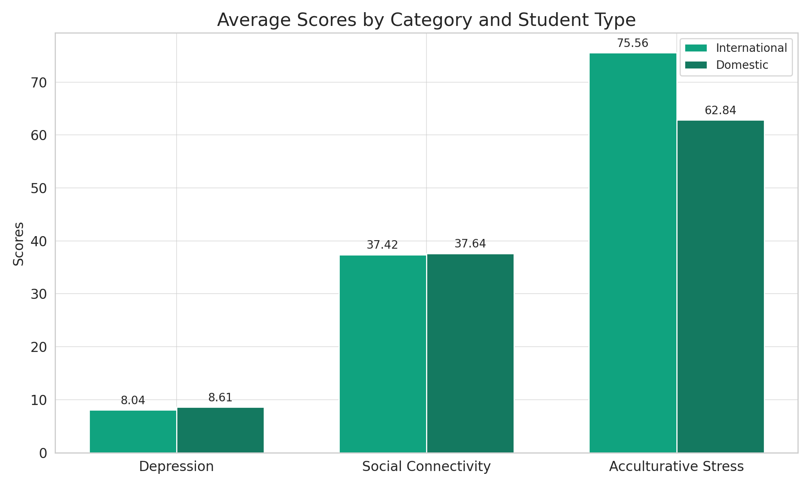
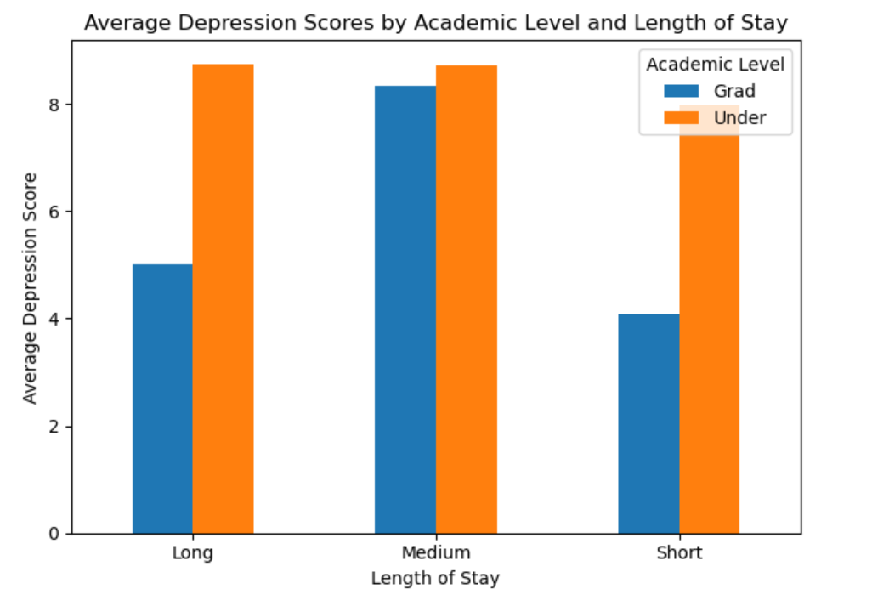
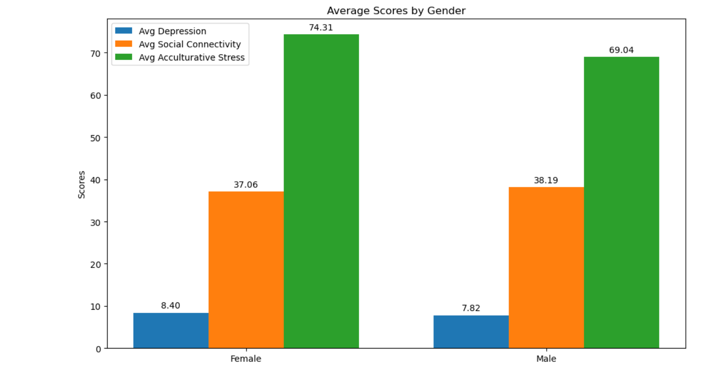
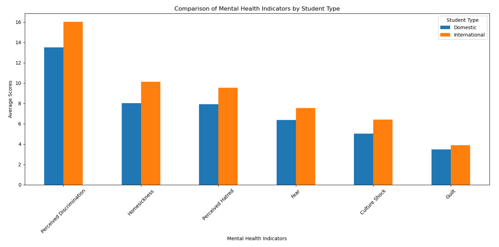
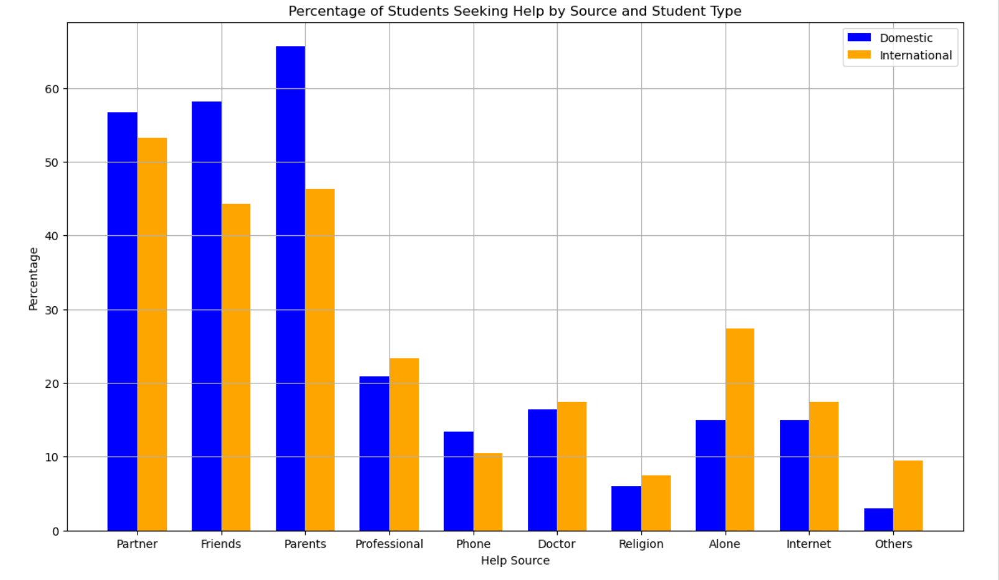

# Introduction:

**Analyzing Students Mental Health Score:** This project aims to analyze the mental health conditions and help-seeking behaviors of students at an international university in Japan 🇯🇵, focusing on factors such as depression 😔, social connectedness 👫, acculturative stress 😰, and the impact of demographic variables like nationality 🌍, gender 🚻, academic level 🎓, and language proficiency 🗣️. 

By leveraging a comprehensive dataset 📊, the study seeks to uncover the nuanced ways in which different factors contribute to the mental well-being of international and domestic students 🎒, providing insights that could guide the development of targeted support services 🎯💡.

SQL queries? Check them out here: [project_student folder](/project_student/)

# Background:

Embarking on university life abroad can significantly impact mental health. A study by a Japanese university 📚 confirmed that international students face greater mental health challenges 🌏, with social connectedness 👫 and acculturative stress 🤯 being key predictors of depression. 

As an international student myself in the U.S. this study propelled my interest in analyzing the data to unveil patterns that might not only explain but also help mitigate the mental health risks associated with international student life. 🧠💡

# Dataset: 

**The dataset comprises of 268 records from both international and domestic students in an international university in Japan.**

| Field Name    | Description                                        |
| ------------- | -------------------------------------------------- |
| `inter_dom`     | Types of students (international or domestic)    |
| `japanese_cate` | Japanese language proficiency                    |
| `english_cate`  | English language proficiency                     |
| `academic`      | Current academic level (undergrad or graduate)   |
| `age`           | Current age of student                           |
| `stay`          | Current length of stay in years                  |
| `todep`         | Total score of depression (PHQ-9 test)           |
| `tosc`          | Total score of social connectedness (SCS test)   |
| `toas`          | Total score of acculturative stress (ASISS test) |


# Objectives:

Below are the key objectives I aimed to explore through my analysis:

### 1. Mental Health Comparisons

Compare depression, social connectedness, and acculturative stress scores between international and domestic students.

### 2. Influencing Factors on Mental Health

- **Duration of Stay**: Examine how the duration of stay influences depression levels in international students.

- **Academic Levels and Stay Duration**: Assess depression levels across different academic levels and lengths of stay.

- **Region of Origin**: Evaluate how a student's region of origin affects their mental health, considering their stay duration.

- **Age Impact**: Investigate the effect of international students' ages on their depression scores.

- **Gender Influence**: Study how gender influences depression scores among students.

- **Language Proficiency**: Evaluate the impact of Japanese and English language proficiency on students' mental health.

### 3. Perceived Challenges:

 Measure the effects of perceived discrimination, homesickness, perceived hatred, fear, culture shock, and guilt on both international and domestic students.

### 4. Help-Seeking Behavior: 

Determine the willingness of international and domestic students to seek help from various sources during emotional difficulties.


# Tools I Used:

In my Data Analyst job market project, I utilized a dynamic suite of tools to navigate and analyze data effectively:

- **SQL & PostgreSQL:** 📊 SQL and PostgreSQL formed the backbone, enabling seamless querying and analysis of job market data.

- **Visual Studio Code:** 💻 Visual Studio Code provided the canvas for coding, offering a user-friendly interface and a plethora of extensions for efficient development.

- **Git:** 🔄 Git kept track of every twist and turn in the project's journey, ensuring version control and collaboration.

- **GitHub:** 🌐 GitHub served as the central repository, fostering collaboration and sharing insights with the community.


# The Analysis:

- I delved into the data using SQL to dissect the various factors affecting student mental health, examining correlations with demographic details and personal experiences. 

- Visualizations brought the numbers to life, clarifying trends and guiding the recommendations to support the well-being of the student community.

**Here's how I approached each objective:**


## 1. Mental Health Comparison:

This SQL query helps compare average mental scores between international and domestic students.

```sql
SELECT 
       inter_dom, 
       MIN(todep) AS Min_Avg_Dep, 
       MAX(todep) AS Max_Avg_Dep, 
       ROUND(AVG(todep), 2) AS Avg_Dep, 
       MIN(tosc) AS Min_Social_Connect, 
       MAX(tosc) AS Max_Social_Connect, 
       ROUND(AVG(tosc), 2) AS Avg_Social_Connect, 
       MIN(toas) AS Min_Acc_Stress, 
       MAX(toas) AS Max_Acc_Stress, 
       ROUND(AVG(toas), 2) AS Avg_Acc_Stress
FROM student_mh
WHERE inter_dom IN ('Inter', 'Dom')
GROUP BY inter_dom;
```


### Key Insights

- **Depression Levels:** A dip into depression scores reveals domestic students have a marginally higher average depression score.

- **Social Connectedness:** When it comes to feeling connected, domestic students feel more on the fringe, but overall, everyone's in the same social boat—fairly buoyant and equally bonded.

- **Acculturative Stress:** Turning to stress associated with learning about and intergrating into a new culture, international students report cranking up the stress-o-meter more than their domestic peers, sharing the same starting line but sprinting towards a higher strain.

*The reason international students experience more stress related to acculturation could be because they simultaneously manage the usual academic pressures while also adapting to an entirely different cultural context, which is a unique challenge that domestic students do not encounter.*


*This bar chart compares the average scores for depression, social connectivity, and acculturative stress between international and domestic students*


## 2. Influencing Factors on Mental Health: 


### a) Duration of Stay:

This SQL query's purpose is to analyze the relationship between the length of stay in a foreign country and the levels of depression among international students. It aims to understand how students' mental health, specifically depression, is associated with the duration of their exposure to and integration into a new culture. 

```sql
SELECT 
    stay, 
    ROUND(AVG(todep), 2) AS Avg_Dep, 
    ROUND(AVG(tosc), 2) AS Avg_Social_Connect, 
    ROUND(AVG(toas), 2) AS Avg_Acc_Stress
FROM 
    student_mh
WHERE 
    inter_dom = 'Inter'
GROUP BY 
    stay
ORDER BY 
    stay;
```


### Key Insights

- We observe that the data does not exhibit a straightforward correlation between the length of stay and depression levels.

- Students with a medium-term stay (5 years) report no depression but have the highest acculturative stress, possibly indicating a critical adjustment period.

- Longer stays do not necessarily correlate with improved mental health or social connectedness, as evidenced by higher depression and lower social connectedness in the 10-year mark.


| Stay | Average Depression | Average Social Connectedness | Average Acculturative Stress |
|------|--------------------|------------------------------|------------------------------|
| 1    | 7.48               | 38.11                        | 72.8                         |
| 2    | 8.28               | 37.08                        | 77.67                        |
| 3    | 9.09               | 37.13                        | 78                           |
| 4    | 8.57               | 33.93                        | 87.71                        |
| 5    | 0                  | 34                           | 91                           |
| 6    | 6                  | 38                           | 58.67                        |
| 7    | 4                  | 48                           | 45                           |
| 8    | 10                 | 44                           | 65                           |
| 10   | 13                 | 32                           | 50                           |


### b) Academic Levels and Stay Duration:

This SQL query is designed to analyze average depression levels among international students, categorized by their academic level and the length of their stay. The aim is to understand if there's a pattern in depression levels based on how advanced a student is in their academic journey and how long they have been staying in a foreign country.

```sql
SELECT 
    academic, 
    stay_cate AS length_of_stay, 
    ROUND(AVG(todep),2) AS Avg_Dep
FROM
    student_mh
WHERE 
    inter_dom = 'Inter'
GROUP BY 
    academic, stay_cate
ORDER BY 
    academic, stay_cate;
```


### Key Insights

**Graduate Students:** 

- Long-term graduate students report the lowest average depression score of 5, which suggests they may adapt better over time.

- Medium-term graduate students experience a higher average depression score of 8.33, indicating a possible peak in depression levels during mid-stay.

- Short-term graduate students show a lower average depression score of 4.08, potentially due to the novelty or initial excitement of the new environment.


**Undergraduate Students:**

- Long-term undergraduates report the highest average depression score among all groups at 8.75, implying that longer stays might not correspond with lower depression for them.

- Both medium and short-term undergraduates have similar average depression scores (8.73 and 7.98, respectively), suggesting a consistent level of depression regardless of stay duration.

*This data may suggest that graduate students adjust more effectively to longer stays than undergraduates. It also highlights a potential trend where undergraduates maintain relatively high depression scores irrespective of the length of stay. This information could be vital for universities to tailor their mental health services specifically for long-term undergraduate students who may be more vulnerable to sustained levels of depression.*



*This bar chart illustrates average depression scores by academic level and length of stay, showing lower scores for graduate students with long and short stays compared to undergraduates who display consistently higher depression scores across all durations.*


### c) Region of Origin:

This SQL query examines the mental health of international students, focusing on depression and how it may vary by region of origin, length of stay.

```sql
SELECT 
    region, 
    ROUND(AVG(todep), 2) AS Avg_Dep, 
    ROUND(AVG(CASE WHEN stay <= 2 THEN todep ELSE NULL END), 2) AS Avg_Dep_Short_Stay,
    ROUND(AVG(CASE WHEN stay > 2 THEN todep ELSE NULL END), 2) AS Avg_Dep_Long_Stay,
    ROUND(AVG(toas), 2) AS Avg_Acc_Stress,
    ROUND(AVG(tosc), 2) AS Avg_Social_Connect
FROM 
    student_mh
WHERE 
    inter_dom = 'Inter'
GROUP BY 
    region
ORDER BY 
    Avg_Dep DESC;
```


### Key Insights

- **East Asia(EA):** Minor fluctuation in depression scores with stay length; moderate stress and good social ties.

- **Southeast Asia(SEA):** Depression increases with longer stays; highest stress, lower social connection.

- **Japan(JAP):** Sharp increase in depression for longer stays; high stress, average social connection.

- **Others:** Marked rise in depression for longer stays; high stress, fairly good social ties.

- **South America(SA):** Depression decreases over time; moderate stress, best social connectivity.


| Region | Avg Dep | Dep Short | Dep Long | Acc Stress | Soc Conn |
|--------|---------|-----------|----------|------------|----------|
| EA     | 8.25    | 8.22      | 8.33     | 69.96      | 38.56    |
| SEA    | 8.2     | 7.88      | 8.74     | 77.79      | 36.61    |
| JAP    | 7.5     | 2         | 13       | 77.5       | 36       |
| Others | 7.09    | 5.44      | 14.5     | 76.55      | 37.18    |
| SA     | 7.06    | 7.33      | 6.5      | 74.61      | 40.17    |


*Overall, the data suggests that the length of stay has variable impacts on depression based on region, with some regions exhibiting higher acculturative stress and changes in social connectivity that could affect mental health over time. This could inform targeted support for international students based on their specific regional challenges and adaptation patterns.*


### d) Age Impact: 

This query aims to determine the average mental health scores for international students, grouped by their age, to see if and how age affects these aspects of their mental health.

```sql
SELECT 
    age, 
    ROUND(AVG(todep), 2) AS Avg_Dep, 
    ROUND(AVG(tosc), 2) AS Avg_Social_Connect, 
    ROUND(AVG(toas), 2) AS Avg_Acc_Stress
FROM 
    student_mh
WHERE 
    inter_dom = 'Inter'
GROUP BY 
    age
ORDER BY 
    age;
```

### Key Insights

- **Depression Scores:** There's variability in depression scores with age, with no clear trend of increasing or decreasing with age.

- **Social Connectivity:** Appear to increase with age, with ages 29 and 31 having some of the highest scores (43 and 43.5 respectively), suggesting older students may feel more connected.

- **Acculturative Stress:** Seem  to vary widely with no clear age-related trend.


| Age | Avg_Depression | Avg_Social_Connect | Avg_Acculturative_Stress |
|-----|----------------|--------------------|--------------------------|
| 17  | 4.67           | 37.33              | 70.67                    |
| 18  | 8.75           | 34.11              | 80.61                    |
| 19  | 8.44           | 37.9               | 74.1                     |
| 20  | 7.35           | 38.21              | 73.26                    |
| 21  | 9.23           | 37.74              | 75.23                    |
| 22  | 8.36           | 38.14              | 70.43                    |
| 23  | 9.67           | 32                 | 81.25                    |
| 24  | 4.67           | 42.33              | 74.33                    |
| 25  | 6.11           | 37.33              | 80.78                    |
| 27  | 10             | 35                 | 42                       |
| 28  | 3.33           | 39                 | 71                       |
| 29  | 3.75           | 43                 | 63.5                     |
| 30  | 9.33           | 41                 | 97.33                    |
| 31  | 5.75           | 43.5               | 80.25                    |

*These results suggest that while age may play a role in social connectivity, with older students feeling more integrated, it does not consistently affect depression and acculturative stress levels.*


### e) Gender Influence:

This query is designed to evaluate whether there's a difference in depression scores, social connectivity, and acculturative stress levels between male and female students. 

```sql
SELECT 
    gender, 
    ROUND(AVG(todep), 2)AS Avg_Dep, 
    ROUND(AVG(tosc), 2) AS Avg_Social_Connect, 
    ROUND(AVG(toas), 2) AS Avg_Acc_Stress
FROM 
    student_mh
GROUP BY 
    gender
ORDER BY 
    gender;
```

### Key Insights

- Female students have a  higher average depression score (8.4) compared to male students (7.82).
Average Social Connectivity (avg_social_connect):

- Male students report higher average social connectivity (38.19) than female students (37.06), suggesting that male students might feel slightly more integrated into their social groups.

- Female students experience higher acculturative stress on average (74.31) compared to male students (69.04), indicating that female students might face more challenges adapting to a new cultural environment.

*These differences could inform targeted support services for female students, recognizing the unique challenges and experiences that may be associated with gender.*



*This bar chart compares average mental health scores by gender, indicating females report higher depression, acculturative stress and lower social connectivity than males.*

### f) Language Proficiency:

These SQL queries are designed to analyze how language proficiency (Japanese and English) relates to mental health outcomes among students. 

```sql
SELECT 
    japanese_cate AS Japanese_Proficiency,
    ROUND(AVG(ToDep), 2) AS Avg_Dep, 
    ROUND(AVG(ToSC), 2) AS Avg_Social_Connect, 
    ROUND(AVG(ToAS), 2) AS Avg_Acc_Stress
FROM 
    student_mh
GROUP BY 
    japanese_cate
ORDER BY 
    CASE japanese_cate
        WHEN 'High' THEN 1 
        WHEN 'Medium' THEN 2 
        ELSE 3 
    END;
```
```sql
SELECT 
    english_cate AS English_Proficiency,
    ROUND(AVG(ToDep), 2) AS Avg_Dep, 
    ROUND(AVG(ToSC), 2) AS Avg_Social_Connect, 
    ROUND(AVG(ToAS), 2) AS Avg_Acc_Stress
FROM 
    student_mh
GROUP BY 
    english_cate
ORDER BY 
    CASE english_cate
        WHEN 'High' THEN 1 
        WHEN 'Medium' THEN 2 
        ELSE 3 
    END;
```

### Key Insights

- High Japanese proficiency is linked to the lowest acculturative stress.
- Low Japanese proficiency is linked to the highest acculturative stress.
- High English proficiency associates with lower depression and acculturative stress.
- Low English proficiency sees the highest depression, indicating language barriers impact mental health.

| Japanese Proficiency | Avg Depression | Avg Social Connectivity | Avg Acculturative Stress |
|----------------------|----------------|-------------------------|--------------------------|
| High                 | 8.17           | 38.01                   | 64.6                     |
| Average              | 8.45           | 37.6                    | 75.36                    |
| Low                  | 7.95           | 36.85                   | 76.86                    |


| English Proficiency | Avg Depression | Avg Social Connectivity | Avg Acculturative Stress |
|---------------------|----------------|-------------------------|--------------------------|
| High                | 7.98           | 37.05                   | 75.3                     |
| Average             | 8.31           | 38.48                   | 67.44                    |
| Low                 | 9.32           | 37.05                   | 68.36                    |

*Language proficiency is key to reducing stress and depression in international students. High local language skills ease cultural adaptation; strong English skills offer broader support and integration.*


### 3) Perceived Challenges:

The purpose of this query is to assess and compare the average levels of perceived discrimination, homesickness, perceived hatred, fear, culture shock, and guilt among international (Inter) and domestic (Dom) students. It aims to quantify the average intensity of these feelings within each group, possibly to identify specific challenges faced by international students as compared to their domestic counterparts and to tailor support services accordingly. 

```sql
SELECT 
    inter_dom, 
    ROUND(AVG(APD), 2) AS Avg_Perc_Discrimination, 
    ROUND(AVG(AHome), 2) AS Avg_Homesickness, 
    ROUND(AVG(APH), 2) AS Avg_Perc_Hatred, 
    ROUND(AVG(AFear), 2) AS Avg_Fear, 
    ROUND(AVG(ACS), 2) AS Avg_Culture_Shock, 
    ROUND(AVG(AGuilt), 2) AS Avg_Guilt
FROM 
    student_mh
GROUP BY 
    inter_dom
ORDER BY 
    inter_dom;
```

### Key Insights

- International students report higher perceived discrimination (16.04) compared to domestic students (13.52).

- A significant difference is observed with international students feeling more homesick (10.13) than domestic students (8.03).

- International students also experience more perceived hatred (9.55) than their domestic counterparts (7.91).

- Again, international students report higher levels of fear (7.55) in comparison to domestic students (6.37).

- International students are more affected by culture shock (6.41) than domestic students (5.03).
Guilt:

- International students experience slightly more guilt (3.88) than domestic students (3.49).

*Overall These insights suggest that international students face greater challenges across all measured emotional and psychological dimensions, which could be attributed to the stresses of adapting to a new cultural environment. This underscores the need for targeted support for international students, including counseling, peer support networks, and cultural acclimation programs.*



*This bar chart compares average scores of perceived discrimination, homesickness, perceived hatred, fear, culture shock, and guilt between domestic and international students, with international students scoring higher on all accounts.*

### 4. Help-Seeking Behavior: 

The purpose of this query is to determine the percentages of international (Inter) and domestic (Dom) students who are willing to seek help from different sources during emotional distress.

```sql
SELECT 
    inter_dom,
    ROUND((SUM(CASE WHEN Partner_bi = 'Yes' THEN 1 ELSE 0 END)::decimal / COUNT(*)) * 100, 2) AS Partner_Percentage,
    ROUND((SUM(CASE WHEN Friends_bi = 'Yes' THEN 1 ELSE 0 END)::decimal / COUNT(*)) * 100, 2) AS Friends_Percentage,
    ROUND((SUM(CASE WHEN Parents_bi = 'Yes' THEN 1 ELSE 0 END)::decimal / COUNT(*)) * 100, 2) AS Parents_Percentage,
    ROUND((SUM(CASE WHEN Professional_bi = 'Yes' THEN 1 ELSE 0 END)::decimal / COUNT(*)) * 100, 2) AS Professional_Percentage,
    ROUND((SUM(CASE WHEN Phone_bi = 'Yes' THEN 1 ELSE 0 END)::decimal / COUNT(*)) * 100, 2) AS Phone_Percentage,
    ROUND((SUM(CASE WHEN Doctor_bi = 'Yes' THEN 1 ELSE 0 END)::decimal / COUNT(*)) * 100, 2) AS Doctor_Percentage,
    ROUND((SUM(CASE WHEN religion_bi = 'Yes' THEN 1 ELSE 0 END)::decimal / COUNT(*)) * 100, 2) AS Religion_Percentage,
    ROUND((SUM(CASE WHEN Alone_bi = 'Yes' THEN 1 ELSE 0 END)::decimal / COUNT(*)) * 100, 2) AS Alone_Percentage,
    ROUND((SUM(CASE WHEN Internet_bi = 'Yes' THEN 1 ELSE 0 END)::decimal / COUNT(*)) * 100, 2) AS Internet_Percentage,
    ROUND((SUM(CASE WHEN Others_bi = 'Yes' THEN 1 ELSE 0 END)::decimal / COUNT(*)) * 100, 2) AS Others_Percentage
FROM 
    student_mh
GROUP BY 
    inter_dom
ORDER BY 
    inter_dom;
```

### Key Insights

**Domestic Students:**
- More likely to seek help from parents (65.67%) and friends (58.21%).
- Less likely to seek help alone (14.93%) or from the internet (14.93%).

**International (Inter) Students:**
- More likely to seek help from professionals (23.38%) and alone (27.36%).
- Less likely to turn to friends (44.28%) and parents (46.27%) compared to domestic students.

**Both Student Groups:**
- Similar percentages of seeking help from partners, with domestic students slightly more inclined.
- International students are more open to seeking help from various sources like the internet (27.36%) and others (9.45%).

*These insights indicates that international students might face barriers in seeking traditional support from family and friends, possibly due to geographical and cultural distances, leading them to rely more on professionals and digital means. This suggests that universities could enhance their professional support services and online resources to better accommodate the needs of international students.*



*This bar chart displays the proportions of domestic and international students seeking help from various sources, showing that domestic students tend to seek help from parents most frequently, while international students show a greater preference for seeking help alone and from the internet.*


# What I Learned Tackling SQL for the Student Mental Health Analysis Project:

**Complex Queries:** Mastered constructing nested queries and case statements to segment data based on specific conditions.

**Data Interpretation:** Gained proficiency in interpreting query outputs to draw meaningful conclusions about student mental health.

**Visualization Skills:** Enhanced ability to visualize complex data sets, translating SQL results into comprehensible charts.

**Actionable Data:** Recognized the importance of actionable insights, recommending targeted support measures based on data analysis.

# Conclusion:

### Insights drawn from the overall analysis: 

- The duration of stay does not straightforwardly correlate with better mental health; in some cases, longer stays are associated with higher depression levels.

- Graduate students generally reported lower levels of depression with long and short stays compared to undergraduates, who showed consistently higher levels across all durations. This suggests that graduate students might better adapt over time or have different stressors compared to undergraduates.

- Female students reported higher levels of depression and acculturative stress than male students, pointing to the need for gender-sensitive support services.

- Higher proficiency in English and Japanese correlated with lower levels of depression and acculturative stress, emphasizing the importance of language support.

- International students experience higher levels of perceived discrimination, homesickness, and other negative emotions than domestic students, highlighting the unique challenges faced by those studying abroad.

-  International students show a significant tendency to use digital means for support, suggesting that online mental health resources could be particularly beneficial.

### Closing Thoughts: 

Tackling this project honed my SQL skills and taught me the value of nuanced data analysis in understanding student mental health. The interplay between academic levels, cultural differences, and language proficiency offered a complex picture of students' experiences, guiding me toward more empathetic and context-aware data interpretations. This experience has deepened my appreciation for the delicate balance between numbers and narratives in the realm of data analytics.